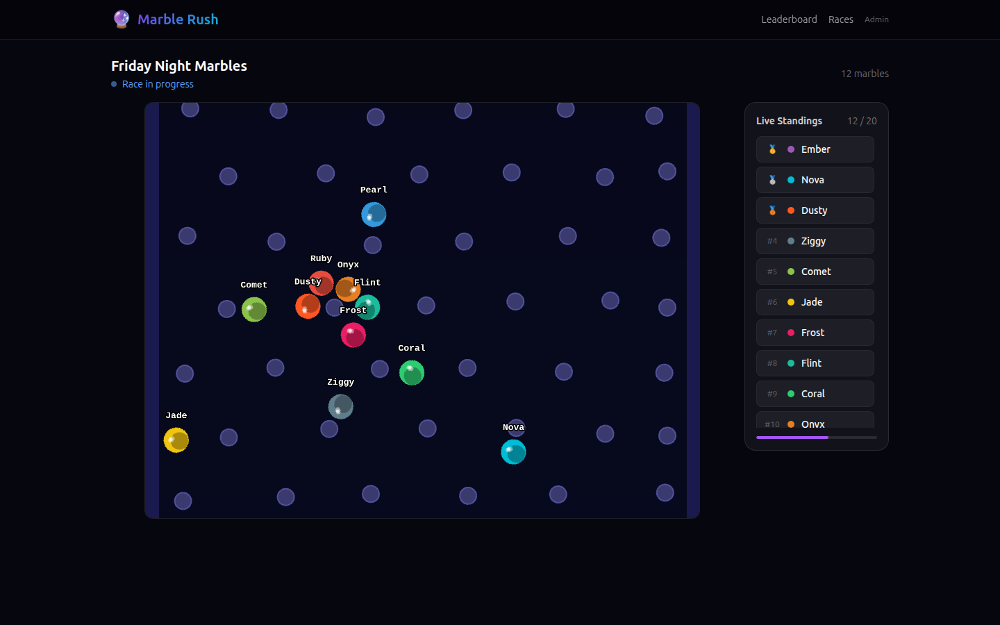
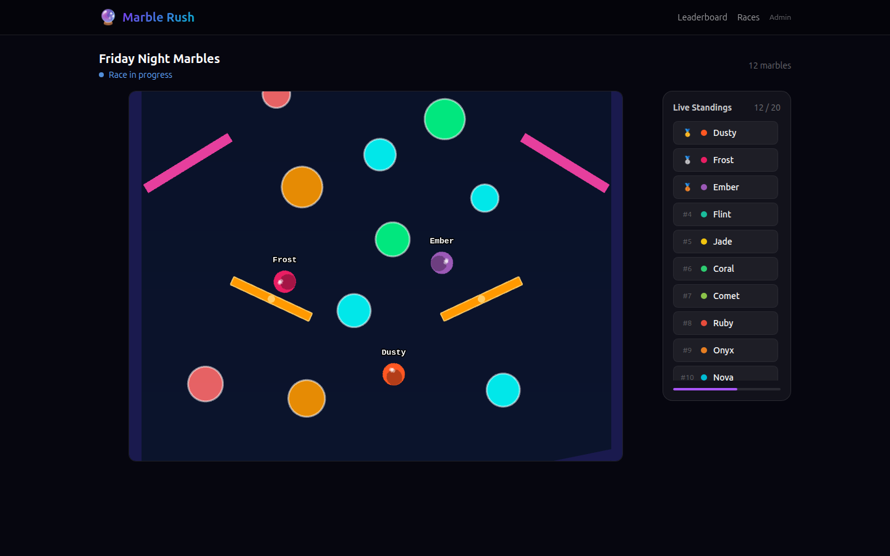
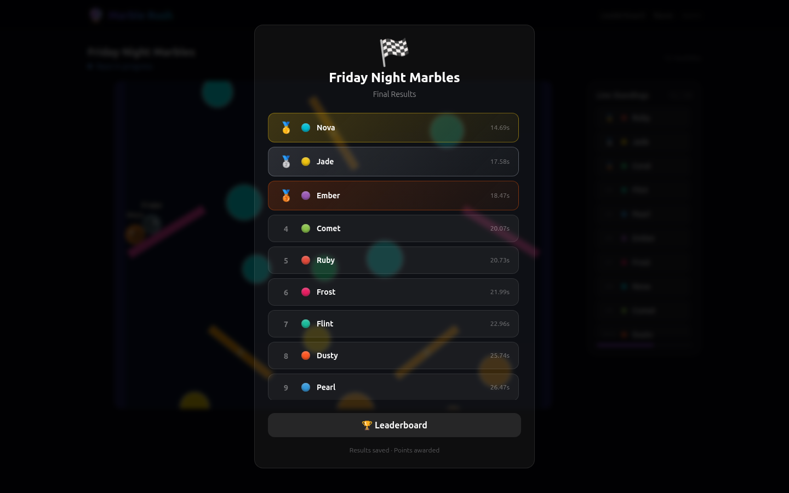

# Marble Rush

A real-time marble racing game for groups of friends. Physics runs entirely in the browser: a long 2D marble-run track with pachinko and pinball elements, built with Phaser 3 + Matter.js. The admin browser is authoritative for results. Built with Next.js 14, Tailwind CSS, and Supabase.

## Screenshots

| Pachinko peg field | Pinball zone | Final results |
|---|---|---|
|  |  |  |

The track runs vertically for 4,900px: starting chute → pachinko peg field → funnel → zigzag ramps → speed pads → pinball zone (bumpers, spinners, slingshots) → slalom maze → final straight → finish line. Live standings update in the side panel and the camera follows the leader (or any marble you click).

## Overview

- Players join a lobby, choose a name, optionally upload a custom marble texture
- Admin starts the race; all browsers run the same deterministic physics simulation
- Admin browser saves the official finish order to Supabase
- Results are broadcast to all viewers via Supabase Realtime
- Points accumulate on a persistent leaderboard

## Setup

### 1. Clone and install

```bash
git clone <repo-url>
cd marble-race
npm install
```

### 2. Create a Supabase project

Go to [supabase.com](https://supabase.com) and create a new project.

### 3. Run the database schema

In the Supabase SQL Editor, paste and run the contents of `supabase/schema.sql`.

### 4. Create the Storage bucket

In Supabase Storage:
1. Create a new bucket called `marble-textures`
2. Set it to **Public** (so image URLs are accessible without authentication)
3. The bucket policies will allow public reads; writes go through the service key in API routes

### 5. Configure environment variables

Copy `.env.local.example` to `.env.local` and fill in:

```
NEXT_PUBLIC_SUPABASE_URL=https://your-project.supabase.co
NEXT_PUBLIC_SUPABASE_ANON_KEY=your_anon_key
SUPABASE_SERVICE_KEY=your_service_role_key
ADMIN_PASSWORD=choose_a_strong_password
```

Find these in your Supabase project under **Settings → API**.

### 6. Run locally

```bash
npm run dev
```

Visit `http://localhost:3000`.

## Deploy to Vercel

### Option A: Vercel CLI

```bash
npm i -g vercel
vercel
```

### Option B: GitHub integration

1. Push the repo to GitHub
2. Go to [vercel.com](https://vercel.com) → New Project → Import from GitHub
3. Set environment variables in the Vercel dashboard (same as `.env.local`)
4. Deploy

### Point a custom domain (e.g. marbles.nathanjoel.com)

1. In Vercel: Project → Settings → Domains → Add `marbles.nathanjoel.com`
2. In your DNS provider: add a CNAME record pointing `marbles` to `cname.vercel-dns.com`
3. Vercel will auto-provision an SSL certificate

## How to Create the First Race

1. Visit `/admin`
2. Enter your `ADMIN_PASSWORD`
3. Click **Create Race** and fill in the form
4. Click **Open Entries** to open the lobby
5. Share the race URL (shown in the admin panel) with friends
6. When enough people have joined, click **Start Countdown**
7. Click **Start Race!** to drop the marbles
8. When the race finishes, results are automatically saved

## Fairness & Pure-Luck System

Marble Rush is designed so that **no skill can influence the outcome**:

- **Deterministic track layout**: The track layout is seeded (same seed = same obstacles). Track geometry is identical for all simulations.
- **Random spawn positions**: Marble starting positions are randomly shuffled each race — no marble gets the same slot twice in expectation.
- **Random micro-forces**: Slow-moving marbles get a tiny random nudge every 500ms. This breaks up pile-ups and ensures even the same seed produces different race outcomes each time.
- **Physics variance**: Matter.js floating-point calculations vary slightly by frame rate and device, adding natural variance.
- **Admin authority**: The admin browser's finish order is saved as official. Non-admin viewers run the same simulation locally for visual purposes only.

## Marble Textures

Custom marble textures are **cosmetic only**:

- The physics body is always a perfect circle of radius 18px, regardless of texture
- Image uploads are validated (JPEG/PNG/WebP, max 2MB, no SVG)
- Images are stored in Supabase Storage and served as public URLs
- If an image fails to load, the marble falls back to its assigned colour

## Points System

| Position | Points |
|----------|--------|
| 1st | 10 |
| 2nd | 7 |
| 3rd | 5 |
| 4th–10th | 2 |
| Finisher (11th+) | 1 |
| DNF | 0 |

Points are only awarded in races where **Award Points** is enabled (default: yes). Leaderboard tracks wins, podiums, races entered, average finish position, and fastest finish time.

## Testing Guide

### Manual testing checklist

**Lobby:**
- [ ] Open `/` — should redirect to active race or show no-race message
- [ ] Create a race in `/admin`
- [ ] Open entries; visit the race URL in another browser
- [ ] Join with a name; verify it appears in the entrant list instantly (realtime)
- [ ] Try joining twice with the same browser session — should be rejected
- [ ] Try joining with a duplicate name — should be rejected
- [ ] Upload a custom marble image; verify it appears as the marble texture

**Race flow:**
- [ ] Click Start Countdown — verify countdown appears on viewer's screen
- [ ] Click Start Race — verify marbles drop and race begins
- [ ] Watch the physics simulation run to completion
- [ ] Verify results modal appears with correct finish order
- [ ] Check `/leaderboard` — verify points were awarded

**Admin:**
- [ ] Wrong password → shows error, doesn't log in
- [ ] Create race while another is active → shows error
- [ ] Remove entrant → disappears from viewer's list immediately

**Edge cases:**
- [ ] Race timeout: if marbles get stuck, race ends after the configured timeout
- [ ] Refresh mid-race → page re-syncs with current race status
- [ ] Results already saved → POST to results API returns existing results (idempotent)

## Architecture Notes

- **API routes**: All writes use the Supabase service key (bypasses RLS). Reads use the anon key.
- **Admin auth**: Password sent in `x-admin-password` header. Not cryptographic — intended for trusted group of friends.
- **Realtime**: Supabase `postgres_changes` subscriptions on `races`, `entrants`, and `race_results` tables.
- **Phaser**: `MarbleRaceGame` is loaded dynamically with `ssr: false` and imports Phaser at runtime, so the game engine never runs server-side. The track is generated deterministically from the race seed in `TrackGenerator.ts`; sections: starting chute → pachinko peg field → funnel → zigzag ramps → speed pads → pinball zone (bumpers, spinners, slingshots) → slalom maze → final straight → finish.
